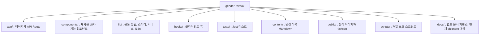

# Codebase Structure

**Analysis Date:** 2026-03-12

## Directory Layout

## Directory Purposes

**app/**
- Purpose: 라우트 엔트리와 API Route를 둔다.
- Contains: `page.tsx`, `layout.tsx`, `route.ts`, route 전용 하위 컴포넌트
- Key files: `app/page.tsx`, `app/create/page.tsx`, `app/reveal/page.tsx`, `app/countdown/[token]/page.tsx`, `app/api/**/route.ts`
- Subdirectories: `api/`, `create/`, `reveal/`, `countdown/[token]/`, `examples/`, `changelog/`

**components/**
- Purpose: 여러 페이지에서 재사용하는 UI와 기능 블록을 둔다.
- Contains: `components/ui/**`, `components/reveal-form/**`, `components/feedback/**`, `components/animations/**`
- Key files: `components/header.tsx`, `components/footer.tsx`, `components/reveal-form/reveal-form.tsx`, `components/social-share.tsx`
- Subdirectories: `ui/`, `reveal-form/`, `feedback/`, `animations/`

**lib/**
- Purpose: 도메인과 무관한 공통 로직, 환경, 서비스, 번역 리소스를 둔다.
- Contains: schema, error helper, logger, Redis client, i18n, markdown parser
- Key files: `lib/errors.ts`, `lib/api-utils.ts`, `lib/env.server.ts`, `lib/redis.ts`, `lib/rate-limit.ts`, `lib/schemas/*.ts`
- Subdirectories: `schemas/`, `services/`, `i18n/`, `utils/`

**hooks/**
- Purpose: 클라이언트 전용 상호작용 훅을 둔다.
- Contains: voting polling, device id, feedback modal throttle, toast hook
- Key files: `hooks/useVoteStatus.ts`, `hooks/useDeviceId.ts`

**tests/**
- Purpose: Jest 테스트를 기능별로 분리 저장한다.
- Contains: API route 테스트, 보안 테스트, 통합 UI 테스트, mock 파일
- Key files: `tests/countdown-timer.integration.test.tsx`, `tests/dday-reveal-data.test.ts`, `tests/security/feedback-security.test.ts`, `tests/__mocks__/jose.js`
- Subdirectories: `security/`, `__mocks__/`

**content/**
- Purpose: 변경 이력 Markdown 원본을 둔다.
- Key files: `content/changelog/2025-12-28.md`, `content/changelog/2026-01-23.md`

**public/**
- Purpose: 이미지, 썸네일, favicon 같은 정적 리소스를 둔다.
- Key files: `public/images/gender_reveal_main.png`, `public/images/favicon/site.webmanifest`

**scripts/**
- Purpose: 개발 보조 스크립트를 둔다.
- Key files: `scripts/generate-secret.js`, `scripts/check-redis-connection.js`

## Key File Locations

**Entry Points:**
- `app/layout.tsx` - 앱 전역 셸
- `app/page.tsx` - 메인 페이지
- `app/create/page.tsx` - 생성 플로우 시작점
- `app/reveal/page.tsx` - 공개 결과 렌더링
- `app/countdown/[token]/page.tsx` - D-Day 카운트다운

**Configuration:**
- `package.json` - 스크립트와 의존성
- `next.config.js` - Next.js 빌드 설정
- `tsconfig.json` - TypeScript와 경로 별칭
- `tailwind.config.ts` - Tailwind theme 확장
- `biome.json` - 포매터/린터 설정
- `jest.config.js` - Jest 설정

**Core Logic:**
- `app/api/**/route.ts` - 서버 경계
- `lib/schemas/*.ts` - 입력 규칙
- `lib/services/*.ts` - 외부 연동
- `lib/dday-utils.ts` - D-Day 공통 로직
- `hooks/useVoteStatus.ts` - 카운트다운 투표 polling

**Testing:**
- `tests/` - 기능 테스트 전용 트리
- `tests/__mocks__/jose.js` - JWT mock

**Documentation:**
- `README.md` - 사용자용 개요와 실행 방법
- `CLAUDE.md` - 저장소 작업 규칙
- `content/changelog/*.md` - 변경 이력 원본

## Naming Conventions

**Files:**
- Route 파일은 Next.js 규약을 따른다: `page.tsx`, `layout.tsx`, `route.ts`
- 일반 컴포넌트와 훅 파일은 kebab-case 또는 `useXxx.ts` 패턴을 사용한다. 예: `components/social-share.tsx`, `hooks/useVoteStatus.ts`
- 테스트 파일은 `.test.ts`, `.test.tsx`, `.integration.test.tsx` 패턴을 사용한다.

**Directories:**
- 기능 묶음은 소문자 디렉터리로 분리한다. 예: `reveal-form/`, `feedback/`, `animations/`
- 동적 라우트는 App Router 규칙을 사용한다. 예: `app/countdown/[token]/`

## Where to Add New Code

**새 페이지 또는 라우트:**
- 구현: `app/<route>/page.tsx`
- 서버 엔드포인트: `app/api/<feature>/route.ts`
- 페이지 전용 보조 컴포넌트: 해당 라우트 하위 `components/`

**새 재사용 컴포넌트:**
- 공통 UI: `components/ui/`
- 기능 컴포넌트: `components/<feature>/`
- 테스트: `tests/`에 기능 기준 파일 추가

**새 비즈니스 로직:**
- 스키마: `lib/schemas/`
- 공통 유틸: `lib/`
- 외부 연동: `lib/services/`
- 클라이언트 상태 훅: `hooks/`

## Special Directories

**.next/**
- Purpose: Next.js 빌드 산출물
- Source: `next dev` 또는 `next build`
- Committed: No. `.gitignore`에 포함된다.

**coverage/**
- Purpose: Jest coverage 산출물
- Source: `npm test`
- Committed: No. `.gitignore`에 포함된다.

**docs/**
- Purpose: 추가 문서 저장 경로
- Source: 수동 작성
- Committed: 현재 `.gitignore`의 `docs/` 규칙 때문에 기본적으로 추적되지 않는다.

---
*Structure analysis: 2026-03-12*
*Update when directory structure changes*
